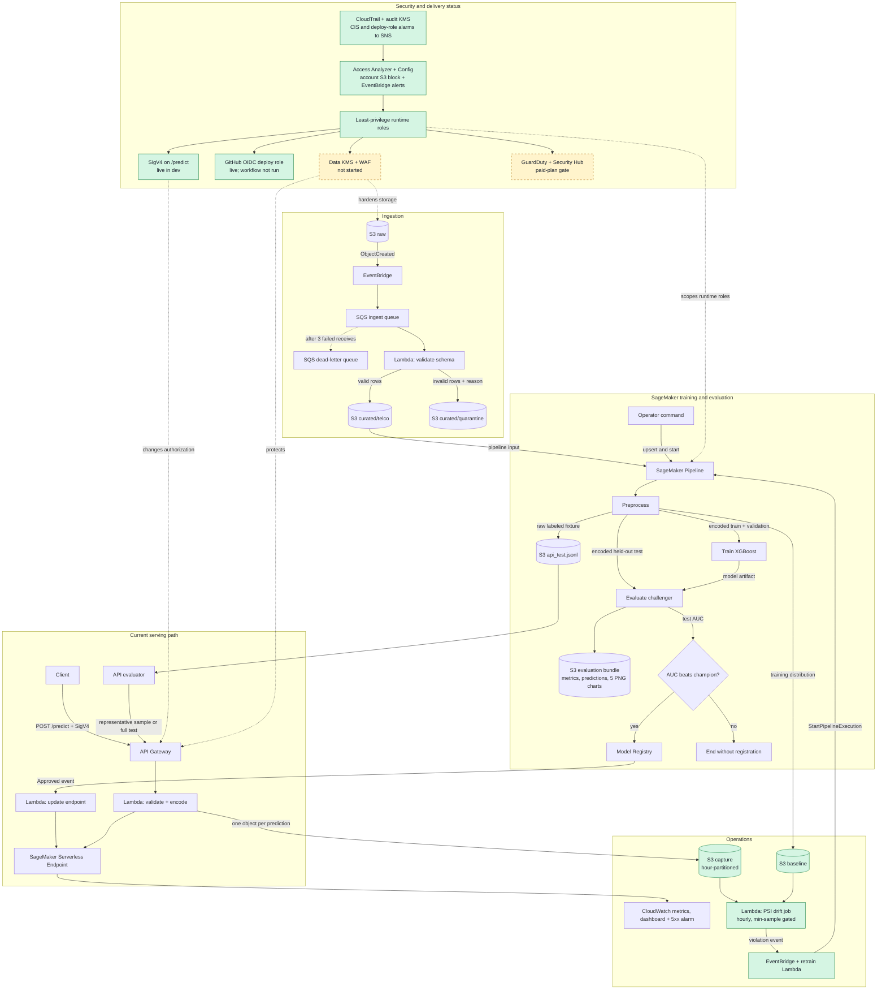

# aws-mlops-platform

> **Portfolio review only.** All rights are reserved. This project is not open
> source. No license is granted to copy, use, modify, distribute, or deploy it
> beyond GitHub's required public-repository rights.

> **Public snapshot.** This repository contains the reviewed project state.
> Its public Git history begins with this release; private development history
> is intentionally not included.

A portfolio-grade **MLOps reference platform** on AWS where the *infrastructure is the deliverable*. The model is deliberately simple (Telco customer churn with XGBoost); the engineering lives in ingestion, reproducible evaluation, champion/challenger promotion, infrastructure as code, CI/CD, and low-cost serverless inference.

`make deploy ENV=dev` creates the nine infrastructure stacks. The SageMaker Pipeline is then upserted through the SDK-driven pipeline command because its definition depends on live Model Registry state. The current dev environment has completed ingestion, training, held-out evaluation, model registration, serverless deployment, API inference, and the audit-and-detection half of the security roadmap.

## Architecture



The ingestion, training, serving, and operations groups show implemented
behavior. The security group shows delivery status, not event flow. Green nodes
have live dev evidence. Yellow nodes are deferred. The GitHub OIDC role is live,
but `deploy.yml` has not run.

### Generated CDK views

`make diagrams ENV=dev` renders the complete CDK app, the ML platform stacks,
and the security plus CI/CD stacks. These diagrams show synthesized desired
state, not live AWS state. Each view includes a PNG preview, a self-contained
editable SVG, and a Graphviz DOT source. See the
[generated CDK infrastructure diagrams](wiki/pages/architecture/generated-cdk-diagrams.md).

## Current operational loop

1. A raw CSV upload is validated before accepted rows are written to curated S3.
2. The pipeline creates deterministic training, validation, held-out test, and raw API-verification fixtures.
3. `Evaluate` scores the challenger on unseen test data, writes the JSON/CSV/PNG report bundle, and exposes test AUC to the promotion gate.
4. A `ConditionStep` registers the challenger only when its test AUC is strictly greater than the current approved champion's AUC.
5. Registry approval (automatic in dev, manual in prod) triggers the deployment Lambda, which creates or updates the SageMaker serverless endpoint.
6. API Gateway and the proxy Lambda validate and encode `/predict` requests before invoking the endpoint. The API evaluator can replay the labeled held-out fixture through this deployed serving path.

The drift-to-retrain leg is closed, and the platform owns both ends of it.
SageMaker Model Monitor supports neither serverless endpoints nor new customers,
so nothing here depends on it. The proxy Lambda writes each served record and
its score to an hour-partitioned S3 capture prefix; the preprocessing step
writes the training distribution as a baseline; and an hourly Lambda scores the
previous hour against that baseline using the Population Stability Index in
`src/common/drift.py`. When enough columns move it emits the platform's own
violation event, which starts a training run.

Two limits are deliberate and worth stating. A window holding fewer than
`MIN_RECORDS` captured predictions is **skipped rather than scored**: a
serverless endpoint is idle most of the time, and PSI over a handful of rows
reports sampling noise. And because churn labels are never observed after a
prediction, this loop detects that the input traffic changed — it cannot detect
that the model got worse. See the
[capture-design decision](wiki/pages/decisions/drift-capture-design.md).

## Repo map

| Path | What |
|---|---|
| `infra/` | CDK app: nine stacks split by lifecycle and blast radius, including security monitoring and CI/CD identity |
| `infra/config/` | `dev.yaml` / `prod.yaml`; the shape is typed once as `PlatformConfig` in `infra/stacks/shared.py` |
| `infra/security_checks.py` | cdk-nag gate: every acknowledgement is bound to one construct and names the phase that removes it |
| `src/common/` | Single source of truth: `schema.py` (pydantic contract shared by ingestion and the inference API) and `features.py` (column order, accepted vocabulary, and encoding) |
| `src/pipeline/` | SageMaker Pipeline definition + preprocess/evaluate scripts |
| `src/ingestion/`, `src/serving/`, `src/monitoring/` | Lambda handlers (validate, proxy with capture, endpoint deploy, drift evaluation, drift retrain) |
| `scripts/` | API evaluation, deployment verification, and the drift-traffic demo helper |
| `wiki/` | LLM-maintained, interlinked knowledge base for the platform |
| `.github/workflows/` | CI, full-history secret scanning, and manual OIDC-federated deployment |

## Quickstart

```bash
cp .env.example .env         # fill in stack outputs after deploy; source with: set -a && source .env && set +a
make install                 # deps
make lint test               # local checks
make bootstrap ENV=dev       # once per account/region
make deploy ENV=dev          # all nine stacks
make diagrams ENV=dev        # PNG, SVG, and DOT desired-state diagrams

# 1. Supply a compatible Telco churn CSV locally; the dataset is not redistributed.
aws s3 cp /path/to/telco.csv s3://<raw-bucket>/telco.csv

# 2. Train: upsert + run the pipeline (registers the first champion).
# Module form (-m), not a file path: pipeline.py imports src.common.features,
# which is only importable with the repository root on sys.path.
uv run --locked --extra pipeline python -m src.pipeline.pipeline \
  --pipeline-name churn-training-pipeline-dev \
  --role-arn <PipelineRoleArn output> --curated-bucket <curated> \
  --artifacts-bucket <artifacts> --model-package-group churn-model-group --start

# 3. Serve: approval auto-deploys the endpoint. The smoke test uses SigV4.
AWS_PROFILE=<profile> make smoke ENV=dev

# 4. Inspect the execution's report bundle in the artifacts bucket, then run
# the API verification command shown in the next section.
```

Capture starts as soon as the Serving stack is deployed, and the drift job needs
a baseline, so run the pipeline at least once before expecting a drift
evaluation to score anything. `scripts/send_drift_traffic.py` sends
distribution-shifted traffic through the API when you want to see the loop
close on demand.

## Model evaluation reports

Each `Evaluate` ProcessingStep scores a model on the held-out test split. It
stores an execution-scoped report bundle under
`s3://<artifacts-bucket>/evaluations/<UTC-start-timestamp>/<execution-id>/`:
the existing `evaluation.json` (AUC and Model Registry input), `metrics.json`,
`predictions.csv`, and PNG confusion-matrix, ROC, precision-recall,
calibration, and score-distribution charts. The confusion matrix uses the same
`0.50` cutoff as the `/predict` API: a probability of `0.50` or above is
classified as churn.

After an endpoint deployment, validate the deployed serving path against the
same raw, labeled held-out records. The default is a deterministic,
class-balanced sample of 25 records; use `--all` for the full test split.

```bash
API_URL=https://<api-id>.execute-api.us-east-1.amazonaws.com/dev/predict \
uv run --locked --extra dev python scripts/evaluate_api.py \
  --pipeline-execution-arn <pipeline-execution-arn> \
  --profile <profile> --region us-east-1

# Full held-out test-set API evaluation (more endpoint invocations):
API_URL=https://<api-id>.execute-api.us-east-1.amazonaws.com/dev/predict \
uv run --locked --extra dev python scripts/evaluate_api.py \
  --pipeline-execution-arn <pipeline-execution-arn> --all \
  --profile <profile> --region us-east-1
```

The evaluator discovers the `api_test` fixture output of that execution,
checks that every API response obeys the probability and `0.50` classification
contract, and prints labeled endpoint metrics. The offline `Evaluate` report
remains the source of truth for model promotion.

## LLM Wiki

The repository also includes a local-first LLM Wiki. `wiki/raw/` stores immutable source material; `wiki/pages/` stores the maintained synthesis; `wiki/index.md` and `wiki/log.md` provide navigation and history; and `wiki/SCHEMA.md` defines the agent's operating contract.

```bash
make wiki-search Q="SageMaker permissions"
make wiki-ingest SOURCE=/path/to/article.md TITLE="Article title"
make wiki-lint
```

The helper is intentionally deterministic and does not call an LLM. It handles source registration, page scaffolding, index rebuilding, full-text search, operation logging, and health checks so an LLM can focus on reading, synthesis, and cross-referencing.

## Decisions log

| Decision | Choice | Rationale |
|---|---|---|
| Serving | SageMaker Serverless Inference | Scales to zero (~$0 idle); registry-native; cold-start latency accepted and named |
| Managed vs. primitive | Mix | SageMaker where ML lineage matters (training and registry); primitives (S3/SQS/Lambda) for transport and integration |
| Orchestration | SageMaker Pipelines | Step lineage + caching for free vs. hand-rolled Step Functions |
| Promotion | ConditionStep vs. champion AUC | Challenger must beat champion; no silent regressions |
| IaC | CDK (Python) | Type-checked infra, same language as the ML code |
| CI auth | GitHub OIDC | No long-lived keys in secrets |
| Pipeline via SDK | Not CloudFormation | SageMaker Pipelines are versioned documents and resolve live champion state; CDK owns the supporting IAM |
| Drift capture | Proxy-side capture + own PSI job | Model Monitor supports neither serverless endpoints nor new customers; owning it keeps the endpoint at near-zero idle cost and removes the hourly processing job |
| Security rollout | Phase-by-phase | Audit and guardrails precede KMS, least privilege, IAM/SigV4, TLS, and WAF changes so failures stay attributable |

## Security and cost posture

Current dev baseline:

- Raw, curated, and artifact buckets block public access, enforce TLS, use
  AWS-managed SSE-KMS encryption, retain versions, and deliver server access
  logs to a dedicated log bucket. Moving these three to a customer-managed key
  is phase 4; the audit bucket already uses one.
- Runtime responsibilities use separate validation, pipeline, proxy, deployment,
  and model roles. Phase 5 replaces the broad ones one at a time: the proxy is
  scoped to invoke only the configured endpoint and write its own log group, the
  model role reads only the training prefix of the artifacts bucket, the deploy
  role names the endpoint and model package group it may touch, and the pipeline
  role names each bucket prefix, job pattern, and log group a training run
  uses. Phase 5 is complete: no role attaches `AmazonSageMakerFullAccess`, and
  the only remaining wildcard resource is account-level S3 Block Public Access,
  where AWS accepts nothing else.
- `/predict` requires IAM authorization and SigV4. The account has no API key
  or usage plan. The API stage retains rate 10 and burst 20 throttles.
- Audit and detection are deployed. A multi-region CloudTrail with log-file
  validation writes to a retained, customer-managed-KMS-encrypted bucket and to
  a 90-day CloudWatch log group. Six CIS metric filters cover root activity,
  unauthorized API calls, IAM policy changes, trail changes, KMS key
  disable/delete, and bucket policy changes. A seventh security detection
  alarms on each production deploy-role assumption. All seven alarms publish
  to the security SNS topic. IAM Access Analyzer, AWS Config, account-level S3
  Block Public Access, and security event routing are enabled in dev through
  the `security.services` flags. GuardDuty and Security Hub remain behind the
  paid-plan gate. WAF is not enabled.
- Serverless inference has no configured provisioned concurrency, so endpoint
  compute has no standing instance while idle. S3, logs, and other retained AWS
  resources still incur small ongoing charges. The monthly budget is `$20` and
  alerts at 50/80/100%. It is account-scoped and owned by exactly one
  environment (`security.account_budget`, true in dev only): AWS Budgets is an
  account-level service, so a budget per environment would re-measure the same
  dollars and alarm twice on them. Scoping a budget to one environment needs a
  `CostFilters` tag filter, which reports zero until that tag is activated as a
  cost allocation tag in Billing — a manual step, and a budget matching nothing
  never alarms at all.

The [phased security hardening roadmap](wiki/pages/architecture/phased-security-hardening.md)
runs 0-9: baseline, repository guardrails, audit and detection, threat
detection services, customer-managed KMS encryption, least-privilege IAM,
IAM/SigV4 API authorization, TLS/logging, WAF, and operator-identity cleanup.
Phases 0-2 and 5 are complete. Phase 3 is partial: Access Analyzer, AWS Config,
account S3 blocking, and alert routing are live in dev. GuardDuty and Security
Hub remain behind the paid-plan gate. Phase 6 is deployed to dev with its
observation window open. Phases 4 and 7-9 are not started. The per-phase
records live in `wiki/pages/sources/`.

## Copyright and security

Copyright 2026 Emanuel J. Cortes-Lugo. All rights are reserved. This repository
is available for portfolio review only. It is not open source. No license is
granted to copy, use, modify, distribute, or deploy the project. Third-party
asset notices are in [NOTICE](NOTICE).
Report vulnerabilities through GitHub's private reporting flow as described in
[SECURITY.md](SECURITY.md). Do not include security details in a public issue.
